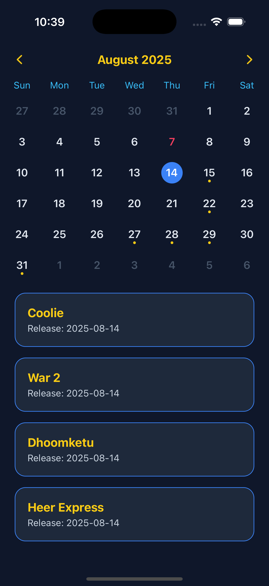
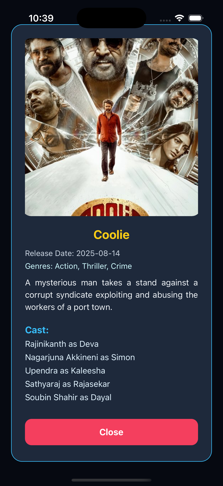

<p align="center">
  <h1 align="center">OutfitCraft</h1>  
</p>

## Introduction

🎬 Release Calendar Feature — CEHPOINT App
The Release Calendar Screen in the CEHPOINT React Native App offers users a visually interactive way to track upcoming movie releases using a calendar-based interface.

With seamless integration to The Movie Database (TMDB) API, the feature fetches upcoming movies, organizes them by release date, and displays them on a dynamic calendar. Users can explore each day's movie list, view detailed information including cast and genres, and interact with a smooth, modal-based UI.

✨ Key Features
📅 Calendar Integration

Displays all upcoming movie release dates with marked dots

Automatically selects the first available date for quick viewing

🎞️ Dynamic Movie List

Movies are grouped by release date

Users can tap any date to view all releases scheduled for that day

🧾 Movie Details Modal

View poster, title, overview, release date, top cast, and genres

Persistent UI with graceful error handling and caching

🔁 Offline-friendly

Leverages local state and optimized fetch logic to minimize API calls

🌙 Dark UI Theming

Fully styled with dark theme and custom color palettes for modern, cinematic feel

---

## :camera_flash: Screenshots

<div align="center" style="margin:auto;width:100%;display:flex;justify-content:center;align-items:center;flex-wrap:wrap;">


</div>
<br>
<br>

## Development

Make Sure you have [React Native development environment setup](https://reactnative.dev/docs/environment-setup)

```bash
# Install dependencies
yarn install
or
npm install
```

```bash
# Run android
npm run android
or
yarn android
```

```bash
# Run ios
npm run ios
or
yarn ios
```

# CEHPOINT-App
